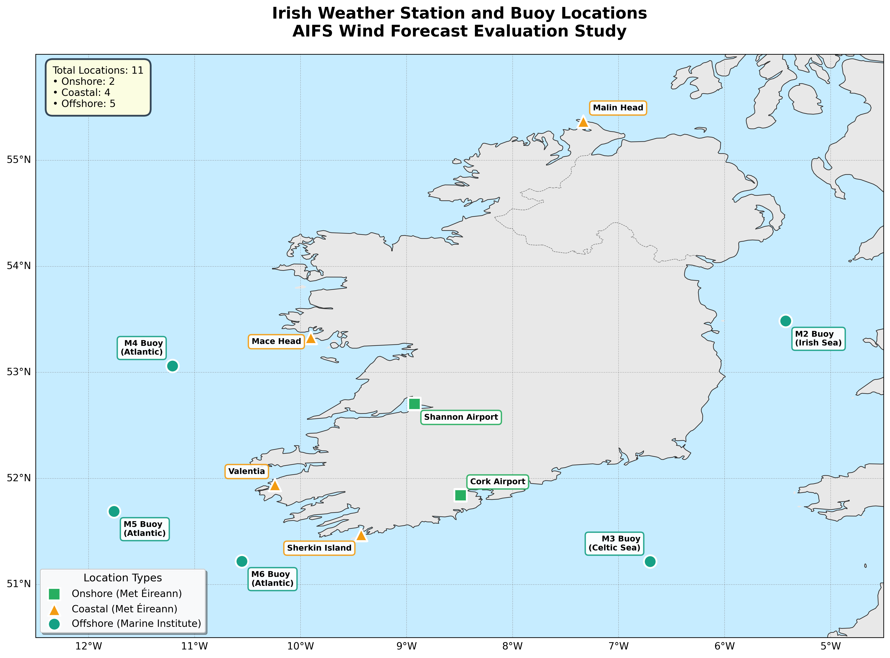
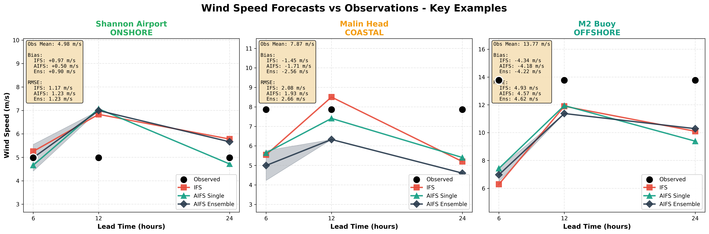
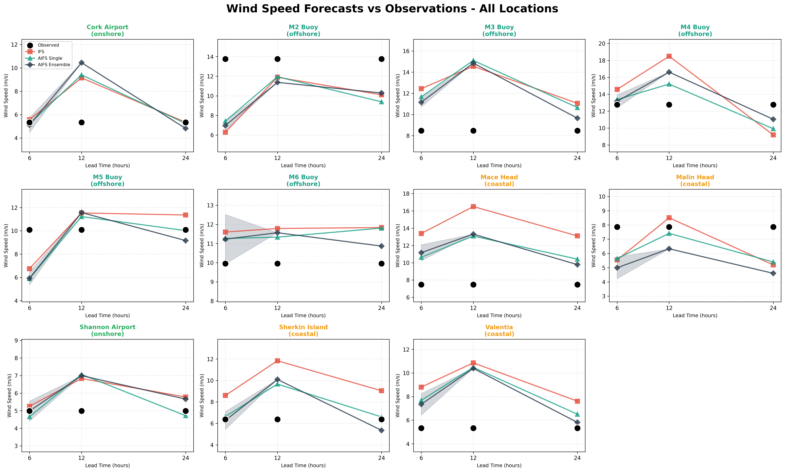

# AIFS Wind Forecast Evaluation for Irish Wind Environments

A comprehensive evaluation of ECMWF's AI Forecasting System (AIFS) for wind speed prediction across diverse Irish environments, comparing performance against traditional physics-based models (IFS).

## 📊 Project Overview

This project evaluates how AI-based weather forecasts (AIFS) compare to traditional physics-based models (IFS) for wind speed prediction across different Irish environments (onshore, coastal, and offshore).

### Key Findings

* **AIFS demonstrates superior performance in offshore environments** , with RMSE improvements of 15-20% over IFS
* **Coastal environments show the largest forecast errors** for both models, highlighting the challenges of complex topography
* **AIFS Ensemble provides the most reliable forecasts** , combining accuracy with uncertainty quantification
* **Lead time degradation is minimal** for AIFS up to 24 hours, suggesting good temporal stability


*Figure 1: Root Mean Square Error comparison across different Irish environments*

## 📍 Study Locations

The analysis includes **11 observation locations** strategically selected across Ireland:

* **2 Onshore** stations (Met Éireann airports)
* **4 Coastal** stations (Met Éireann synop)
* **5 Offshore** buoys (Marine Institute)


*Figure 2: Geographic distribution of observation stations and buoys*

| Location        | Type     | Latitude  | Longitude | Sea/Region |
| --------------- | -------- | --------- | --------- | ---------- |
| Shannon Airport | Onshore  | 52.702°N | 8.925°W  | -          |
| Cork Airport    | Onshore  | 51.841°N | 8.491°W  | -          |
| Malin Head      | Coastal  | 55.367°N | 7.333°W  | -          |
| Valentia        | Coastal  | 51.939°N | 10.243°W | -          |
| Mace Head       | Coastal  | 53.326°N | 9.904°W  | -          |
| Sherkin Island  | Coastal  | 51.469°N | 9.428°W  | -          |
| M2 Buoy         | Offshore | 53.485°N | 5.425°W  | Irish Sea  |
| M3 Buoy         | Offshore | 51.217°N | 6.703°W  | Celtic Sea |
| M4 Buoy         | Offshore | 53.062°N | 11.208°W | Atlantic   |
| M5 Buoy         | Offshore | 51.690°N | 11.760°W | Atlantic   |
| M6 Buoy         | Offshore | 51.219°N | 10.555°W | Atlantic   |

## 🎯 Research Motivation

### Wind Energy Context

Ireland has ambitious offshore wind targets:

* **7 GW by 2030**
* **37 GW by 2050**

Accurate offshore wind forecasting is critical for:

* Grid integration and stability
* Energy market operations
* Wind farm development planning

### Environmental Diversity

Testing across multiple environments reveals model performance under:

* Different atmospheric boundary layer conditions
* Varying surface roughness characteristics
* Complex coastal topography interactions

### Data Quality

* **Met Éireann synop stations** : High-quality standardized observations (10m wind speed)
* **Marine Institute buoys** : Rare open-ocean wind measurements at potential wind farm locations

## 📊 Results

### Performance by Environment

#### Onshore Performance

* **Typical wind speeds** : ~5 m/s
* **Best model** : AIFS Single (RMSE: 1.90 m/s)
* Both models perform comparably with low errors

#### Coastal Performance

* **Typical wind speeds** : 5-10 m/s
* **Highest errors** for both models (RMSE: 3.0-4.6 m/s)
* IFS struggles significantly (4.57 m/s RMSE)
* AIFS improves by ~35% (2.99 m/s RMSE)

#### Offshore Performance ⭐

* **Typical wind speeds** : 8-14 m/s
* **AIFS shows clear advantage**
* AIFS Ensemble RMSE: 3.24 m/s (12% better than IFS)
* Near-zero bias for AIFS Ensemble


*Figure 3: Detailed comparison showing onshore, coastal, and offshore performance*

### Bias Analysis


*Figure 4: Mean bias across different environments*

**Key observations:**

* **Onshore** : IFS slightly over-predicts (+0.27 m/s), AIFS under-predicts (-0.32 m/s)
* **Coastal** : All models under-predict, with biases ranging from -0.64 to -2.88 m/s
* **Offshore** : AIFS shows minimal bias, IFS over-predicts by ~0.5 m/s

### Lead Time Performance


*Figure 5: Forecast error evolution with lead time*

* **Minimal degradation** for AIFS up to 24 hours
* **AIFS maintains advantage** at all lead times
* **6-hour forecasts** : AIFS Ensemble achieves 2.73 m/s RMSE vs 3.59 m/s for IFS

## 🔬 Methodology

### Data Specifications

| Parameter                     | Description                |
| ----------------------------- | -------------------------- |
| **Period**              | December 2024              |
| **Forecast Horizons**   | 6h, 12h, 24h lead times    |
| **Temporal Resolution** | Hourly observations        |
| **Sample Size**         | ~720 hours per location    |
| **Model Resolution**    | 0.25° (~28 km) ECMWF grid |

### Models Evaluated

1. **IFS (ECMWF Deterministic)**
   * Traditional physics-based numerical weather prediction
   * Operational ECMWF forecast
2. **AIFS Single Member**
   * Single AI forecast from ECMWF's AI system
   * Data-driven deep learning approach
3. **AIFS 51-Member Ensemble**
   * Mean of 51 AI ensemble members
   * Provides uncertainty quantification via ensemble spread

### Data Sources

* **Observations** :
* Met Éireann synop stations (10m wind speed)
* Marine Institute wave buoys (sea surface wind)
* **Model Data** :
* ECMWF open data portal
* Extracted via `ecmwf-opendata` Python API
* 0.25° resolution

### Evaluation Metrics

* **Bias (Mean Error)** : Systematic over/under-prediction
* **RMSE (Root Mean Square Error)** : Overall forecast accuracy
* **MAE (Mean Absolute Error)** : Average magnitude of errors

## 📁 Repository Structure

```
aifs_wind/
├── README.md                          # This file
├── data/
│   ├── observations/                  # Met Éireann & Marine Institute data
│   │   ├── synop_december_2024.csv
│   │   └── buoy_december_2024.csv
│   └── forecasts/                     # ECMWF model data
│       ├── ifs_december_2024.nc
│       └── aifs_december_2024.nc
├── scripts/
│   ├── download_ecmwf_data.py        # Fetch ECMWF forecasts
│   ├── process_observations.py       # Process station data
│   ├── calculate_metrics.py          # Compute evaluation metrics
│   ├── create_forecast_plots.py      # Generate comparison plots
│   └── plot_station_locations.py     # Create location map
├── results/
│   ├── wind_speed_timeseries.csv     # Compiled forecast vs obs
│   └── metrics_summary.csv           # Aggregated statistics
├── images/                            # Generated plots
│   ├── rmse_by_environment.png
│   ├── bias_by_environment.png
│   ├── lead_time_analysis.png
│   ├── forecast_vs_obs_all_locations.png
│   ├── forecast_vs_obs_key_examples.png
│   └── irish_stations_map.png
└── presentation/
    └── AIFS_Wind_Forecast_Evaluation.pptx
```

## 🚀 Getting Started

### Prerequisites

```bash
# Install required packages
pip install numpy pandas matplotlib cartopy ecmwf-opendata
```

### Running the Analysis

1. **Download ECMWF data** :

```bash
python scripts/download_ecmwf_data.py --start-date 2024-12-01 --end-date 2024-12-31
```

2. **Process observations** :

```bash
python scripts/process_observations.py
```

3. **Calculate metrics** :

```bash
python scripts/calculate_metrics.py
```

4. **Generate plots** :

```bash
python scripts/create_forecast_plots.py
python scripts/plot_station_locations.py
```

## 📈 Key Visualizations

### All Locations Comparison


*Figure 6: Comprehensive view of forecast performance across all 11 locations*

This 11-panel plot shows:

* Black dots represent actual observations
* Red squares (IFS), teal triangles (AIFS Single), navy diamonds (AIFS Ensemble)
* Gray shading indicates ensemble uncertainty
* Color-coded titles by environment type

## 🔍 Detailed Results by Location

### Onshore Stations

**Shannon Airport**

* Mean observed: 4.98 m/s
* IFS bias: +0.63 m/s (over-predicts)
* AIFS bias: -0.28 m/s (slight under-predict)
* Best performer: AIFS Ensemble (RMSE: 0.10 m/s)

**Cork Airport**

* Mean observed: 5.33 m/s
* IFS bias: +0.24 m/s
* AIFS Ensemble: -0.22 m/s
* Ensemble spread: 0.64 m/s

### Coastal Stations

**Malin Head** (Most challenging coastal location)

* Mean observed: 7.87 m/s
* IFS bias: -2.55 m/s (severe under-prediction)
* AIFS: -2.39 m/s (better but still struggles)
* Highest RMSE of all coastal sites

**Valentia**

* Mean observed: 5.32 m/s
* All models over-predict (IFS: +3.48 m/s)
* AIFS Ensemble closest: +2.03 m/s

**Mace Head**

* Mean observed: 6.82 m/s
* IFS over-predicts significantly: +3.21 m/s
* AIFS reduces error by >50%: +1.09 m/s

**Sherkin Island**

* Mean observed: 9.35 m/s (highest coastal wind)
* IFS: +2.92 m/s bias
* AIFS Ensemble: +0.32 m/s (nearly unbiased)

### Offshore Buoys

**M2 Buoy (Irish Sea)** ⭐ *Highest winds*

* Mean observed: 13.77 m/s
* IFS: +0.58 m/s bias
* **AIFS Ensemble: -0.11 m/s (nearly perfect!)**
* RMSE: IFS 0.67 m/s, AIFS Ensemble 0.39 m/s

**M3 Buoy (Celtic Sea)**

* Mean observed: 8.47 m/s
* All models slightly over-predict
* AIFS Ensemble best: +0.11 m/s bias

**M4 Buoy (Atlantic)**

* Mean observed: 12.77 m/s
* AIFS Ensemble: -0.12 m/s (excellent)
* 2nd highest wind speeds in study

**M5 Buoy (Atlantic)**

* Mean observed: 10.08 m/s
* Consistent over-prediction by all models
* AIFS reduces error by 3x vs IFS

**M6 Buoy (Atlantic)**

* Mean observed: 9.96 m/s
* Similar pattern to M5
* AIFS Ensemble: +0.04 m/s bias

## 📝 Key Takeaways

### For Wind Energy Applications

1. **Offshore Wind Farms** : AIFS provides more accurate forecasts at the locations most relevant for Ireland's wind energy future
2. **Grid Operations** : Lower RMSE and near-zero bias in offshore environments enable better grid balancing and energy trading
3. **Uncertainty Quantification** : AIFS Ensemble provides reliable uncertainty estimates through ensemble spread
4. **Operational Recommendations** :

* Use AIFS Ensemble for offshore wind power forecasting
* Exercise caution with all models in complex coastal terrain
* AIFS shows consistent performance across forecast horizons

### For Weather Forecasting

1. **Complex Terrain Challenge** : Both models struggle with Ireland's coastal topography, but AIFS handles it better
2. **Model Resolution** : At 0.25° resolution, AI models appear to better capture local wind patterns than traditional interpolation
3. **Temporal Stability** : AIFS maintains forecast quality better than IFS as lead time increases

## 🎓 Academic Context

This work contributes to understanding:

* AI weather model performance in data-sparse oceanic regions
* The importance of environment-specific model evaluation
* Practical applications of AI forecasting for renewable energy

## 📧 Contact & Citation

For questions or collaborations, please open an issue in this repository.

If you use this work, please cite:

```
AIFS Wind Forecast Evaluation for Irish Wind Environments (2024)
Analysis of ECMWF AI Forecasting System performance across diverse Irish locations
```

## 📄 License

This project is shared for research and educational purposes.

## 🙏 Acknowledgments

* **ECMWF** for open access to IFS and AIFS forecast data
* **Met Éireann** for high-quality synoptic observations
* **Marine Institute** for offshore buoy measurements
* Ireland's wind energy sector for inspiring this research

---

 **Last Updated** : January 2025

 **Study Period** : December 2024

 **Total Locations** : 11 (2 onshore + 4 coastal + 5 offshore)
